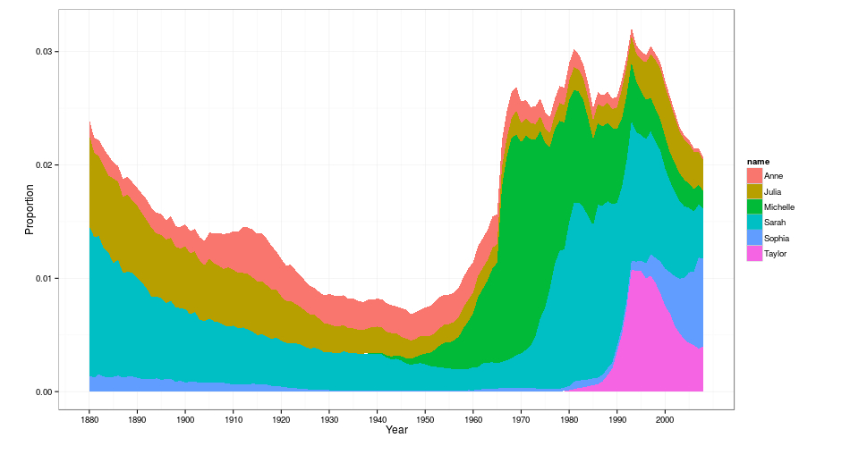

---
url: {lib: "."}
framework   : revealjs 
theme       : sky
transition  : cube
highlighter : highlight.js
hitheme     : tomorrow      
mode        : selfcontained # {standalone, draft}
knit        : slidify::knit2slides  
--- 

## US Baby Names Data Set

Graphical Analysis of Trends

in 

Baby Names

Project for Coursera Class "Developing Data Products"

*by Tatiana Shingel*

--- 

##  US Baby Names Data Set

- The data contains 1000 top male and female baby names collected in the US each year, starting from 1880 until 2008.
- It was aggregated from the [social security administration](http://www.ssa.gov/OACT/babynames/) and was made available for download 
at Hadley Wickham’s [GitHub Repository](https://github.com/hadley/data-baby-names). 
- It consists of 258,000 records (1000 x 2 x 129) in four fields: `year`, `name`, `percent`, and `sex`.
- `percent` field gives the proportion of a corresponding name in any given year.

--- 

## Sample Data
- Reading the data set into R will produce: 

```{r, echo=FALSE}
babynames <- read.csv("./data/baby-names.csv")
head(babynames)
```

- There are many interesting questions one might ask with this data. 
- Here we focus on a simple question of tracking the popularity of a specific name or a group of names over time. 

--- 


## Shiny App
- To run the app, click [US Baby Names Shiny App](https://babynamesapp.shinyapps.io/Project/).    
- This application allows to query the data by name and gender and produce a plot of name usage across a specified time period.  
- There are different plotting options available to the user: `areaplot`, `lineplot`, `boxplot`.
- Trends in name popularity can be displayed simultaneously for multiple names, with the possibility to enter up to eight baby names. 
- `boxplot` displays trends in popularity of entered names as a group. 

--- 

## Sample Shiny App Output


